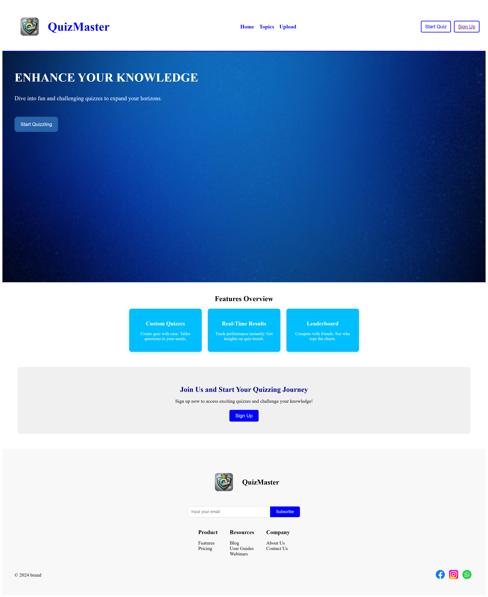
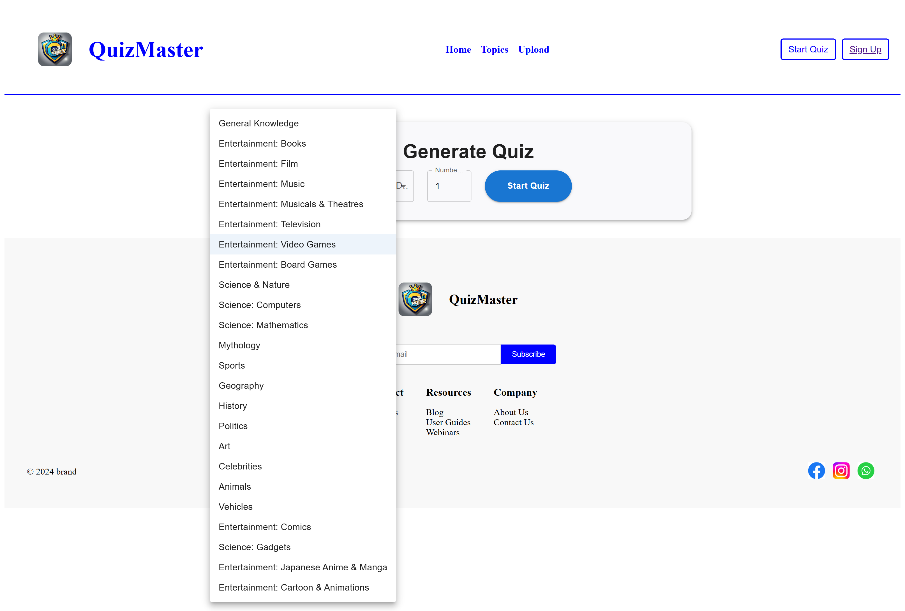
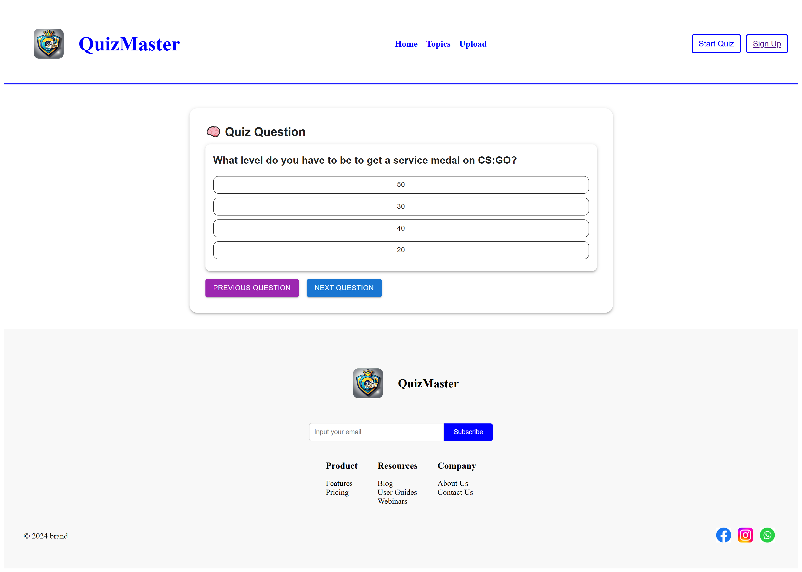
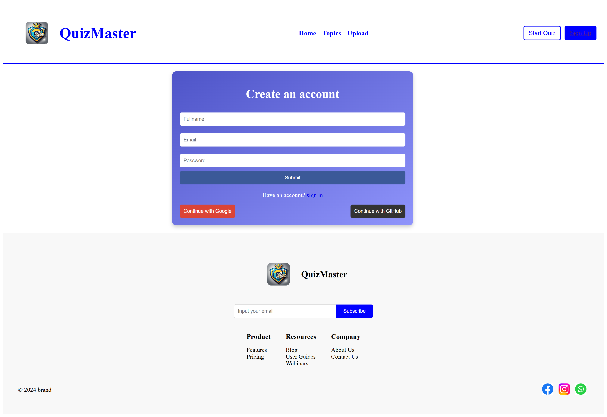
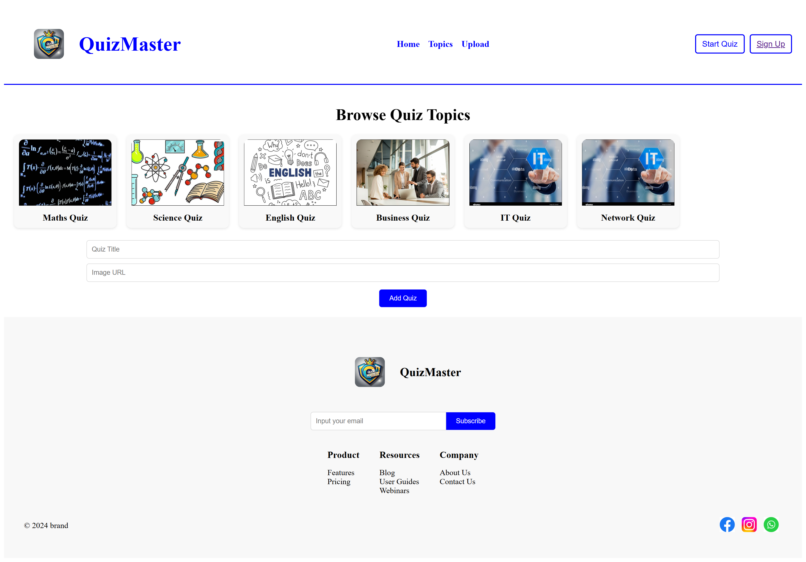
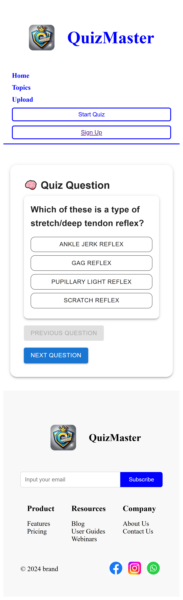

# Quiz App

Welcome to the Quiz App! This application allows users to take quizzes on various topics . It's built with React and Material-UI for a smooth and modern user experience.

## Features

- **Dynamic Quiz Generation**: Fetch quizzes from the Open Trivia Database based on selected categories and difficulties.
- **User-Friendly Interface**: Intuitive design with responsive layout for both desktop and mobile users.
- **Score Tracking**: At the end of the quiz, users receive a score based on their performance.

## Technologies Used

- **React**: For building the user interface.
- **Material-UI**: For styling components and providing a responsive layout.
- **Axios**: For making HTTP requests to fetch quiz data.
- **Vite**: For fast and efficient development.

## Getting Started

### Prerequisites

Make sure you have the following installed on your machine:

- [Node.js](https://nodejs.org/) (version 14 or higher)
- [npm](https://www.npmjs.com/) (comes with Node.js)

### Installation

1. Clone the repository:

   ```bash
   git clone https://github.com/Anadhilah/QuizApp.git
   cd quiz-app
  
2. Install dependencies
    
    ```bash
    npm install

3.  Start the development server

    ```bash
    npm run dev

## Images
   # Home page


# Quiz pages



# sign up page


# topics page


# small screen



  
